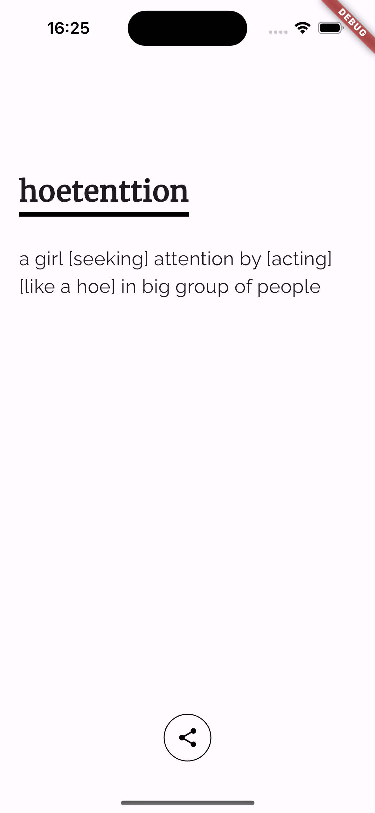

# 📖 Word of the Day App - wotd

A **Flutter** app that fetches and displays a **Word of the Day** from **Urban Dictionary** using the **RapidAPI** service.  

## 🚀 Features
- Fetches a **new word** every day from **Urban Dictionary**.
- Uses **RapidAPI** for definitions, examples, and related words.
- Stores API keys securely using a **`.env` file**.
- Simple, modern, and user-friendly UI.
- Localization

---

## ⚠️ **Important: API Key Setup**
This app requires a **RapidAPI key** for Urban Dictionary.  

1. **Get an API Key from RapidAPI**  
   - Sign up at [RapidAPI](https://rapidapi.com/) if you don’t have an account.  
   - Subscribe to the **Urban Dictionary API**:  
     👉 [Urban Dictionary on RapidAPI](https://rapidapi.com/community/api/urban-dictionary)  
   - Copy your **API Key** from the dashboard.

2. **Create a `.env` File**
   - Inside the project root, create a file named `.env`.  
   - Add the following line to store your API key securely:
     ```env
     RAPIDAPI_KEY=your_api_key_here
     ```
   - **DO NOT** share your `.env` file or commit it to GitHub!

---


